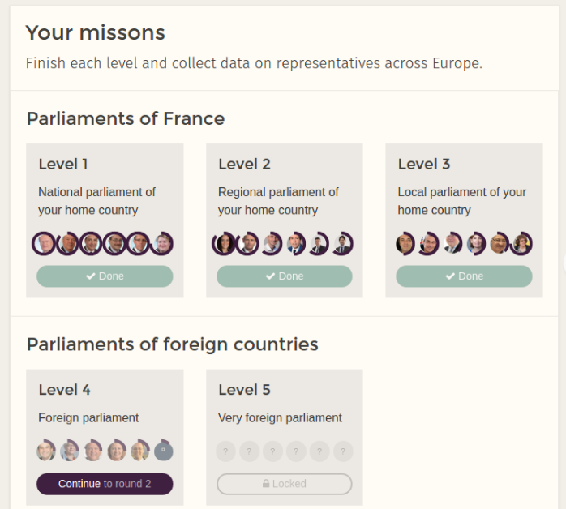

jQuest is a platform for journalism schools. It lets journalism students in Europe **learn** datajournalism, **connect** with one another and **investigate** collaboratively.

Journalism schools enroll students on jQuest as part of their datajournalism teaching. On jQuest, students receive a series of tasks for a Europe-wide investigation. The investigation of the first season is called PoliticalGaps. It explores the representativity of our elected representatives. Which parliaments are most gender-balanced? Which are youngest? These are the questions PoliticalGaps will bring an answer to.

<small>A screenshot of the user's screen on jQuest.</small>

Students also get access to a series of 40 course items detailing the theory, techniques and tools of datajournalism. They can discuss and connect on dedicated messaging channels, where we’ll answer their questions.

We hope that jQuest will let students learn, connect and investigate and give journalism schools an efficient tool to teach datajournalism.

jQuest is the natural continuation of the work we’ve accomplished at Journalism++ in the past 5 years, during which we taught datajournalism to hundreds of students and coordinated several award-winning investigations across Europe.

Twelve schools will try out jQuest in the academic year 2016-2017. If you want your journalism school to join, send us an email at enroll@jquestapp.com.

* Escuela de Periodismo de Unidad Editorial, Madrid
* Académie du Journalisme et des Médias, Neuchâtel
* Department of Journalism, Babeș-Bolyai University, Cluj
* Institute of Journalism and Public Relations, FH Joanneum, Graz
* Ecole de journalisme de Sciences Po, Paris
* Centre de Formation des Journalistes, Paris
* Ecole Française de Journalisme, Levallois
* Ecole Supérieure de Journalisme, Lille
* School of Media, Birmingham City University
* Department of Journalism, Media and Communication, Gothenburg University
* Department of Media and Communication Science, Mittuniversitetet Sweden
* Department of Communication, University of Jyväskylä

We’re proud that jQuest is financed by the [Open Society Foundations' program for independent journalism](https://www.opensocietyfoundations.org/about/programs/independent-journalism).
