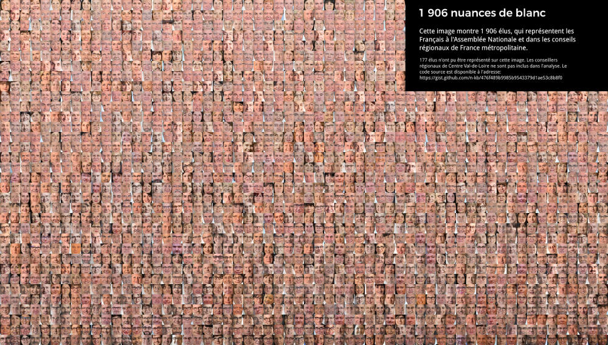

Pour un tutoriel à destination des étudiants de jQuest sur la détection de visages par ordinateur, nous avons fait un trombinoscope des élus français au niveau national et régional (11 régions les plus peuplées uniquement). Si vous avez l'impression que les élus français sont exclusivement des hommes blancs, c'est normal.

<a href="../images/1906nuancesdeblanc.jpg" target="_blank">Cliquez ici pour voir en grand.</a>

Bien sûr, cette image ne peut être analysée sérieusement. L'identité ne se résume jamais à la couleur de peau, et encore moins à la luminosité d'une photo. Et sans information équivalente sur la population générale, impossible de juger la représentativité des élus.

C'est le simple fait que l'on doive en arriver là pour aborder le problème de la discrimination en politique qui devrait interpeller.

En France, les statistiques ethniques ont mauvaise presse. On prétend qu'elles sont illégales. C'est vrai qu'un [article du code pénal](https://www.legifrance.gouv.fr/affichCodeArticle.do?cidTexte=LEGITEXT000006070719&idArticle=LEGIARTI000006417970) punit de cinq ans d'emprisonnement celle qui fera une base de données comportant des critères religieux, ethniques ou raciaux _sans le consentement des intéressés_. Mais on pourrait tout à fait demander aux français, à commencer par leurs représentants, comment ils se sentent perçus. François Héran, un ancien directeur de l'institut national des études démographiques (INED), l'expliquait en 2012 [dans un article de l'Obs](http://leplus.nouvelobs.com/contribution/539164-les-statistiques-ethniques-interdites-en-france-une-belle-hypocrisie.html).

Sans cette information, impossible de savoir à quel point les personnes aux peaux plus foncées sont discriminées. Sont-elles discriminées par les partis, qui refusent de les mettre sur les listes électorales? Sont-elles discriminées par les électeurs, qui refusent de voter pour elles? S'excluent-elles elles-mêmes de la vie politiques? Sans données, impossible de le dire.

Quiconque écoute les revendications de nombreuses personnes racisées sait que la discrimination raciale est l'un des principaux, si ce n'est le principal, reproche fait aux institutions françaises. Tant que le gouvernement, les instituts statistiques et les chercheurs refuseront de mesurer cette dimension cruciale, il sera impossible de juger les éventuels progrès - ou reculs - de la représentation des minorités.

### Méthodologie

Sur une idée originale de Pierre Romera, j'ai sélectionné 11 assemblées représentatives en France (voir la liste ci-dessous). Les photos officielles des élu-e-s ont été extraites automatiquement des sites des assemblées ou, lorsque ce n'était pas possible, collectées par les étudiants des écoles de journalisme partenaire de la plateforme [jQuest](http://www.jquestapp.com/). Les cumulards ont été dé-dupliqués pour n'apparaître qu'une fois. Un programme informatique a ensuite recadré les photos afin de ne sélectionner que le centre du visage, puis a classé les photos en fonction de leur luminosité.

Le code source utilisé pour réaliser l'image est [disponible sur Gist](https://gist.github.com/n-kb/476f489b9985b9543379d1ae53c8b8f0). Les élus représentés siègent dans les assemblées suivantes:

 - Assemblée Nationale
 - Île-de-France
 - Auvergne-Rhône-Alpes
 - Hauts-de-France
 - Nouvelle-Aquitaine
 - Occitanie
 - Grand Est
 - Provence-Alpes-Côte d'Azur
 - Pays de la Loire
 - Normandie
 - Bretagne
 - Bourgogne-Franche-Comté

La région Centre-Val-de-Loire n'a mis en ligne que des photos trop petites pour être exploitables.