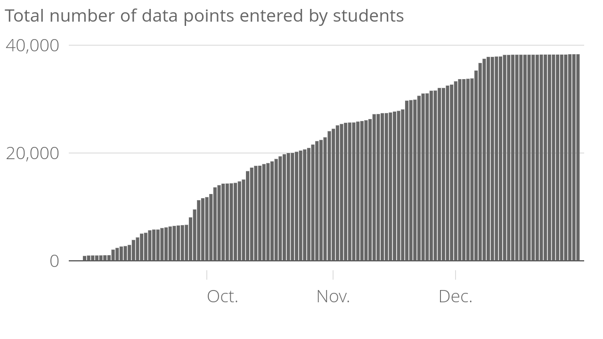

jQuest is a platform that helps journalism schools teach datajournalism to their students. It is made of three components: An investigation where students contribute data on a single topic across all schools, a series of course materials and tutorials and a discussion board where they can ask questions.

## The investigation

Students are asked to work on the representativity of elected representatives in Europe. They collect data on representatives at different levels in their home countries and in other countries. The progress is game-like: Students start with easy tasks (the national parliament of their home country) and are given harder and harder tasks as they progress.

The home screen of the investigation (left) and the data input screen (right)

The data from all students can be downloaded at any time by any student and be used for articles on the topic, such as gender equality across time or borders, the relative age of representatives etc. Some students did publish articles using jQuest data, some of which were published in the national press of their country (Switzerland). We, at Journalism++, also use the data to publish articles, such as an analysis of diversity among French politicians, [available on StreetVox](http://www.streetpress.com/sujet/1484673356-diversite-elus-en-europe), a news outlet for youngsters. 

## The course material

Students can access over 50 courses on different aspects of datajournalism. The course covers the history and theory of the craft as well as detailed overviews of tools and techniques, from freedom of information requests to interactive mapping. A dozen tutorials give students step-by-step instruction on how to use a series of tools, from the simplest datavisualization software to coding.

A screenshot of the first course in the curriculum.

Several courses were added after students or trainers requested them (the course on online security, for instance, or the tutorial on how to use Isotope.js, a Javascript library).

A key aspect of a centralized body of courses lies in its updatability. The tools and, to an extent, techniques of datajournalism evolve rapidly. We changed the courses and tutorials to adapt to the changing reality of the craft, so that students always have the most up-to-date documents.  We rewrote the tutorial on interactive mapping after Carto changed its interface, for instance, and keep our list of datajournalism teams in Europe updated.

## Discussion channel

A Slack channel lets students contact jQuest staff at any time to raise issues or ask questions. We also provide them with links to interesting projects related to datajournalism and grant opportunities they can apply to.

A screenshot of the Slack channel.

# Reach and usage

## Schools

As of December 31st, 2016, 14 schools in 9 countries were active on jQuest. The schools are the following:

* Académie du Journalisme et des Médias, Neuchâtel
* Department of Journalism, University of Gothenburg
* School of Media, Birmingham City University
* Department of Media and Communication Science, Mittuniversitetet Sweden
* Ecole Supérieure de Journalisme, Lille
* Faculty of Communications, Media, and Design, HSE, Moscow
* Ecole de journalisme et de communication, Université Aix-Marseille
* Master de Journalisme Numérique, Université de Lorraine à Metz
* Artevelde University College, Ghent
* Journalism Department, Masaryk University (Brno)
* Eötvös Loránd University (Budapest)
* Budapest Metropolitan University
* MA in Investigative Reporting, Birkbeck College, University of London
* B.A. Onlinejournalismus der Hochschule Darmstadt

9 other schools are slated to start in the second semester.

Our benchmark of reaching 10 schools in the first year is largely passed.

Geographical distribution of students on jQuest in the Fall semester 2016.

## Students

A total of 318 students enrolled in a partner school are active on the platform. The total number of users, which includes teachers, students who registered on their own or inactive students, reaches 600.

Our benchmark of reaching 100 students in the first year is largely passed.

Active students by day since September 1st, 2016.

## Activities

In total, students spent 713 hours on jQuest and collected close to 40,000 data points on elected representatives in Europe.

Data points collected and entered by students since September 1st, 2016.

The amount of work is unevenly spread between students. A minority of users did most of the work, as was expected. Our benchmark was that at least 5% of students carry out more than 100 tasks. In fact, more than 15% passed this milestone (see distribution below). 

However, we expected that over 90% of students would complete at least 10 tasks, which has not been the case. Only three in four students who logged in to the platform completed any task at all. First, many students in Europe do not speak enough English to use jQuest. We believe this to be the main reason behind the relative high rate of unengaged students. More importantly, our data shows that much more can be done regarding the engagement of teachers. In schools where we were teachers ourselves (Neuchâtel, Ecole Supérieure de Journalisme de Lille), student engagement was much higher than average. While we do not intend to translate jQuest (English will remain the working language in Europe for the foreseeable future), we will provide teachers with much more support so that they push their students more intensively towards the platform. 

This histogram shows that 92 students earned between 1 and 5000 points on jQuest. A student receives about 200 points for each piece of information she gathers.

Engagement over course material was similarly uneven. Over half of students read one or more course material. It falls short of our goal of having almost all students read at least some of them (our benchmark), but language issues probably account for most of this discrepancy. One in seven students read more than 20 courses, which is again slightly below our expectations. In the second season of jQuest, we will integrate course materials more closely with the user experience, making sure that students complete quizzes (for which they will have to read through the course materials) directly in the “tunnel” of the user progression.

This histogram shows that 24 students read all courses available on jQuest.

Finally, the discussion channels that we set up with the students will be improved. There were some positive interactions and interesting discussions. Competition between schools (a leaderboard ranks schools by the number of points their students have) led to students taking to Twitter to tease each other when their school passed another one on the leaderboard.

However, communication channels were used mostly to report bugs or ask simple questions related to data collection. Some conversations about deeper issues did arise (such as what to do when an elected representative died during a legislature, or how to characterize the gender of an individual) but more could be done. We also send out a bimonthly newsletter telling students about the new tutorials on jQuest and other information. While it was read (opening rates are over 70%), few students came back to the platform from reading the newsletter. This is why beefing up our community management capabilities is a major improvement we intend to add. We also plan to create tasks that students must collaborate across borders on so that the task can only be completed if two or more students communicate among each other.

Overall, we are extremely happy with jQuest. From a small-scale experiment, it has become a Europe-wide network of schools and students working on a topic that is actually useful to produce novel, data-driven journalism. Not everything's perfect, of course, but we have plenty of ideas for the second season, which will be even better.