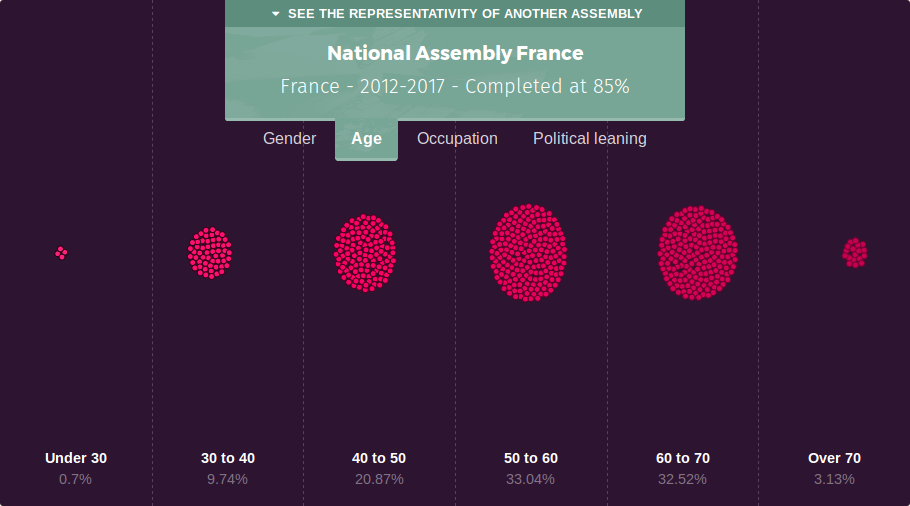
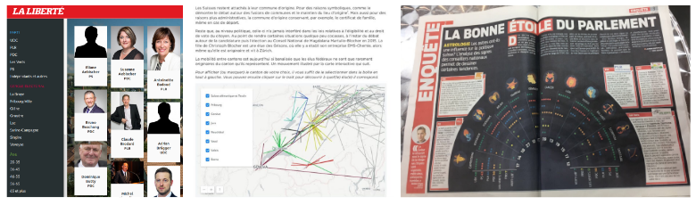

jQuest is a platform that helps journalism schools teach datajournalism to their students. In it, students contribute to an investigation, for which they collect data. The investigation for the academic year 2017/18 is called [Political Gaps](http://www.politicalgaps.eu) and researches the representativity of elected representatives in Europe.

## The data

Students are asked to collect data on representatives at different levels in their home countries and in other countries, from current and older legislatures.

As of January 21st, 2017, the Political Gaps database contains 23,000 elected representatives, for which some basic data has been scraped online. Students manually collected data on 5,000 of those, using information published online or by contacting the elected officials directly. For each person, we collect data on seven dimensions: Gender, age, birthplace, education, occupation, political leaning and role in the assembly.

[PoliticalGaps.eu](http://www.politicalgaps.eu) shows the progress of the investigation for each legislature we research 

The National Assembly of France on [PoliticalGaps.eu](http://www.politicalgaps.eu)

## Published articles

Most of this data is new and exclusive. There are many studies on the representativity of politicians, but very few used a data structure that allowed for comparison across time and space.

We at Journalism++ used the data to write several articles. In an article published in L'Express, a news magazine in France, we checked the claim of a far-right party that it was different from others. Data from [Politcal Gaps](http://www.politicalgaps.eu) showed that it wasn't. Actually, representatives for far-right parties in France are more likely to have a degree form an elite university than others! The article is available online (in French): [FN et extrême droite, des partis comme les autres: la preuve par les données](http://www.lexpress.fr/actualite/politique/fn-et-extreme-droite-des-partis-comme-les-autres-la-preuve-par-les-donnees_1870721.html).

In another article, we looked at the physical appearance of representatives (students on jQuest measure the closeness of an elected official to the stereotype of a politician, which we use as a proxy for a measure of diversity). We showed that French representatives were among the least diverse in Europe (Hungarians come first). The article can be read (in French) at StreetVox: [On a mesuré la diversité des élus en Europe et la France est au fond du classement](http://www.streetpress.com/sujet/1484673356-diversite-elus-en-europe).

Both articles were largely read and shared. They were used to fuel informed debates on social networks and on the radio, which we believe is one of the roles of journalism.

Students at the University of Neuchâtel (Switzerland) also used jQuest data to write articles on the topic. They looked at the social make-up of the National Assembly of Switzerland or at the discrepancy between the home town of politicians and their electoral district. One article, which looked at the astrological signs of the national representatives of Switzerland, was published in a double page spread in Le Matin, the country's top French-speaking tabloid.

Works by students at Neuchâtel. From left to right: An interactive app to browse through representatives of Fribourg, Switzerland, a map showing the place of birth in relation with the place of election and the published version of an infographics on the astrological signs of Swiss representatives.

## Thinking statistically

Looking at the examples above, one sees that we, at Journalism++, and students worked with the data is very different ways.We looked at the data set in its entirety, confident that the few errors that might be in the 60,000-or-so data points were random and would not impact our analyses (we checked this assumption and couldn't infirm it). Students looked only at one legislative assembly at a time, more often at the national level, and would not consider working with data from an assembly which was not 100% complete. More often than not, they complemented jQuest data with data from an official source (which is great, don't get me wrong. But it was a timed exercise and doing so had opportunity costs).

One of the goals of jQuest is to ensure students understand how a data set is put together, how it can be used and how the biases inherent to any data collection effort can be overcome. Working with data collected collaboratively in a transparent manner is not something journalism students (or journalists, for that matter) are used to. Our experience in training showed us that when they work with data, students have no problem using data sets from official sources without questioning the data set in itself.

For now, the students are still reluctant to use the data they themselves collected, mostly because they are concerned about missing values and the potential for error. While they are right to be, it strikes us that they do not fully realize that all data sets should be critically evaluated, including data sets from government-sanctioned sources. 

Our next step with jQuest is bring students beyond data analysis techniques, such as doing a pivot table, and enable them to think statistically. We need to ensure that they are confident enough in their data skills to go beyond government data. After all, investigations such as [The Migrants' Files](http://themigrantsfiles.com) and [The Counted](https://www.theguardian.com/us-news/ng-interactive/2015/jun/01/the-counted-police-killings-us-database) were based on data sets built by journalists from the ground up, in a collaborative manner. Both these investigations won prizes and had an impact in the real world.

jQuest goes on in the second semester. There are still plenty of angles to cover, such as the evolution of gender equality across time (the results will surprise you), the age distribution of representatives by political leaning or the differences between local and national politics.  We will work hard to convey to students that they can, too, think statistically and produce great article from the data they collected.